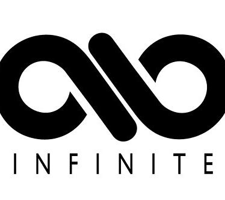

<!-- Improved compatibility of back to top link: See: https://github.com/othneildrew/Best-README-Template/pull/73 -->
<a name="readme-top"></a>
<!--
*** Thanks for checking out the Best-README-Template. If you have a suggestion
*** that would make this better, please fork the repo and create a pull request
*** or simply open an issue with the tag "enhancement".
*** Don't forget to give the project a star!
*** Thanks again! Now go create something AMAZING! :D
-->


<!-- PROJECT SHIELDS -->
<!--
*** I'm using markdown "reference style" links for readability.
*** Reference links are enclosed in brackets [ ] instead of parentheses ( ).
*** See the bottom of this document for the declaration of the reference variables
*** for contributors-url, forks-url, etc. This is an optional, concise syntax you may use.
*** https://www.markdownguide.org/basic-syntax/#reference-style-links
-->
[![Contributors][contributors-shield]][contributors-url]
[![Forks][forks-shield]][forks-url]
[![Stargazers][stars-shield]][stars-url]
[![Issues][issues-shield]][issues-url]
[![MIT License][license-shield]][license-url]
[![LinkedIn][linkedin-shield]][linkedin-url]


<!-- PROJECT LOGO -->
<br />
<div align="center">
  <a href="https://github.com/Infinite-FDU/BigDL">
    
  </a>

<h3 align="center">Infitnite FDU</h3>

  <p align="center">
    A conversational AI chatbot for enhancing user queries and assisting in generating improved questions.
    <br />
    <a href="https://github.com/Infinite-FDU/BigDL"><strong>Explore the docs »</strong></a>
    <br />
    <br />
    <a href="https://github.com/Infinite-FDU/BigDL">View Demo</a>
    ·
    <a href="https://github.com/Infinite-FDU/BigDL/issues">Report Bug</a>
    ·
    <a href="https://github.com/Infinite-FDU/BigDL/issues">Request Feature</a>
  </p>
</div>


<!-- TABLE OF CONTENTS -->
<details>
  <summary>Table of Contents</summary>
  <ol>
    <li>
      <a href="#about-the-project">About The Project</a>
      <ul>
        <li><a href="#built-with">Built With</a></li>
      </ul>
    </li>
    <li>
      <a href="#getting-started">Getting Started</a>
      <ul>
        <li><a href="#prerequisites">Prerequisites</a></li>
        <li><a href="#installation">Installation</a></li>
      </ul>
    </li>
    <li><a href="#usage">Usage</a></li>
    <li><a href="#roadmap">Roadmap</a></li>
    <li><a href="#contributing">Contributing</a></li>
    <li><a href="#license">License</a></li>
    <li><a href="#contact">Contact</a></li>
    <li><a href="#acknowledgments">Acknowledgments</a></li>
  </ol>
</details>


<!-- ABOUT THE PROJECT -->
# About The Project

[![Product Name Screen Shot][product-screenshot]](https://example.com)


Welcome to the **Infinit FDU Chatbot** project, your gateway to a world of intelligent conversation and assistance! 🤖✨

The **Infinit FDU Chatbot** is an innovative chatbot powered by state-of-the-art natural language processing models. Whether you're seeking answers, code optimization suggestions, or even help with refining your questions, our chatbot is here to assist you effectively. Designed for a variety of use cases, from code optimization to language model guidance, it's your go-to AI assistant.

Our project leverages the latest advancements in language modeling technology and provides you with a seamless conversational experience. Engage in productive discussions, refine your queries, and harness the power of AI to enhance your workflow.

Get ready to embark on an exciting journey with the **Infinit FDU Chatbot**. Explore its capabilities, improve your communication, and boost your productivity. It's more than just a chatbot; it's your AI companion in the world of natural language understanding and generation.

Start your conversation with the **Infinit FDU Chatbot** today and elevate your interactions to the next level! 🚀🤖

<p align="right">(<a href="#readme-top">back to top</a>)</p>


## Built With

* Streamlit
* Langchain
* Baichuan-13b 

<p align="right">(<a href="#readme-top">back to top</a>)</p>


<!-- GETTING STARTED -->
# Getting Started

Before getting started with the project, ensure that you have the following prerequisites installed:

## Prerequisites

- **Python 3.10**: You'll need Python 3.10 to run this project. We recommend using Anaconda to manage your Python environments. You can create a Python 3.10 environment with the following command:

```bash
conda create -n infinite-fdu python=3.10
```

Activate the environment using:

```bash
conda activate infinite-fdu
```

## Installation

1. Clone the repository to your local machine using the following command:
   ```bash
   git clone https://github.com/Infinite-FDU/BigDL
   ```
2. Navigate to the project directory
3. Install the project dependencies from the `requirements.txt` file:
   ```bash
   pip install -r requirements.txt
   ```

### Check for CUDA Compatibility

Before running the project, it's essential to check whether your computer satisfies the requirements for CUDA support. CUDA is a parallel computing platform and application programming interface (API) model created by NVIDIA.

Some of the deep learning libraries used in this project, such as PyTorch, can leverage CUDA for GPU acceleration. If you have an NVIDIA GPU and wish to enable GPU support, you should ensure that your GPU is compatible with CUDA and that you have the appropriate NVIDIA drivers installed.


If your GPU is not CUDA-compatible or you encounter issues with CUDA, **remove the torch based packages in the `requirements.txt` and install on your own.**


<p align="right">(<a href="#readme-top">back to top</a>)</p>


<!-- USAGE EXAMPLES -->
# Usage

## Prompt Engineering Overview

Welcome to the Infinit FDU Chatbot, your intelligent assistant for prompt engineering. As a prompt engineer, your role is to craft and refine prompts to elicit precise and meaningful responses from language models. This chatbot offers a range of optimization options to assist you in your task.

### 1. Default Optimization

- **User Input:** _Enter your original prompt here._
- **Optimized Output:** _The chatbot will refine your prompt to make it more explicit and effective for language models._

### 2. Code Optimization

- **User Input:** _Share your code snippet or programming-related query._
- **Optimized Output:** _The chatbot will review and enhance your code for better readability and functionality._

### 3. Judge Prompt Word

- **User Input:** _Submit a prompt word or phrase for evaluation._
- **Evaluation Output:** _The chatbot will assess the quality of your prompt and provide a score along with feedback._

### 4. Multi-Step Question

- **User Input:** _Pose a complex question that can be divided into smaller steps._
- **Optimized Output:** _The chatbot will break down your question into manageable parts, perfect for step-by-step exploration._


With the Infinit FDU Chatbot, you can fine-tune prompts, code, and questions to achieve the best results from language models. Optimize, evaluate, and engineer prompts with ease!

## Custom Instructions for Persistent Memory

The Infinit FDU Chatbot empowers you with the ability to provide custom instructions, allowing you to whisper specific guidance to the language model. These custom instructions serve as a form of persistent memory, influencing the behavior of the chatbot across different sessions.

### How Custom Instructions Work

1. **Customize Your Guidance**: Craft personalized instructions in plain text to guide the language model in a particular direction. You can provide context, preferences, or specific expectations.

2. **Save to Local File**: Your custom instructions are saved to a local file, ensuring they persist even after closing the chatbot session. This file acts as a repository of your guidance.

3. **Influence Model Behavior**: During subsequent interactions, the chatbot will refer to your saved custom instructions, effectively remembering your preferences and following your guidance.

4. **Adapt and Refine**: You can update and refine your custom instructions over time, enabling the language model to adapt to your evolving needs and preferences.

### Enhance Your Conversations

Custom instructions provide a powerful way to tailor your interactions with the Infinit FDU Chatbot. Whether you want to fine-tune responses, shape the conversation, or achieve specific outcomes, your instructions serve as a valuable resource for persistent memory and guidance.

Harness the potential of custom instructions to create more meaningful and personalized conversations with the chatbot, making it a truly adaptable assistant that understands your unique requirements.

_For more examples, please refer to the [Documentation](https://python.langchain.com/docs/get_started/introduction)_

<p align="right">(<a href="#readme-top">back to top</a>)</p>


<!-- ROADMAP -->
# Roadmap

## Version 1.0.0 (Initial Release)
- [x] Streamlit app setup with customizable settings and styling.
- [x] Integration of Transformers LLM with support for model selection.
- [x] Four distinct input types: multi-step, judge, code, and default.
- [x] User-friendly interface for prompt engineering with real-time previews.
- [x] System message functionality for context-aware interactions.
- [x] Chat history display for tracking conversations.
- [x] Save customized instructions to a local file for future sessions.
- [x] Documentation and GitHub repository setup.

## Version 1.1.0 (Enhancements)
- [ ] User authentication for personalized experiences.
- [ ] Integration of additional language models for diverse responses.
- [ ] Enhanced UI features, including themes and user preferences.
- [ ] Expansion of prompt optimization techniques.
- [ ] Language translation capabilities for multilingual interactions.
- [ ] Feedback system to allow users to rate AI responses.
- [ ] Integration with voice-based interactions for hands-free use.

## Version 2.0.0 (Advanced Features)
- [ ] Mobile app development for on-the-go chatbot access.
- [ ] Real-time collaboration features for teamwork.
- [ ] Integration with external databases for context persistence.
- [ ] Machine learning for context-aware responses.
- [ ] Natural language understanding for more precise interactions.
- [ ] Advanced error handling and debugging tools.
- [ ] Performance optimizations for scalability.

## Future Versions
- [ ] Continued language support expansion.
- [ ] Integration with popular virtual assistants (e.g., Siri, Alexa).
- [ ] Collaboration with domain-specific experts for specialized knowledge.
- [ ] Exploration of educational and research applications.
- [ ] User feedback sessions for continuous improvement.


See the [open issues](https://github.com/Infinite-FDU/BigDL/issues) for a full list of proposed features (and known issues).

<p align="right">(<a href="#readme-top">back to top</a>)</p>


<!-- CONTRIBUTING -->
# Contributing

🎉 We welcome contributions from the community! If you'd like to get involved and help improve the Infinit FDU Chatbot project, here's how you can contribute:

1. **Bug Reports:** If you encounter any issues while using the app, please [submit a bug report](https://github.com/Infinite-FDU/BigDL/issues) on our GitHub repository. Be sure to include as many details as possible, including screenshots and steps to reproduce the problem.

2. **Feature Requests:** Have an idea for a new feature or enhancement? Share it with us by opening a [feature request](https://github.com/Infinite-FDU/BigDL/issues). We value your input and would love to hear your suggestions.

3. **Code Contributions:** If you're a developer and would like to contribute code to the project, feel free to fork the repository, make your changes, and submit a [pull request](https://github.com/Infinite-FDU/BigDL/pulls). We follow best practices for code review and collaboration.

4. **Feedback and Ideas:** Even if you're not a developer, your feedback and ideas are valuable to us. Please reach out to our team via email or our community forum:

    - 📧 **Email 1:** [contributor1@example.com](mailto:contributor1@example.com)
    - 📧 **Email 2:** [contributor2@example.com](mailto:contributor2@example.com)
    - 📧 **Email 3:** [contributor3@example.com](mailto:contributor3@example.com)

We're committed to making this project better with your help, and we appreciate your contributions, large or small. Thank you for being a part of the Infinit FDU Chatbot community!


<p align="right">(<a href="#readme-top">back to top</a>)</p>


<!-- LICENSE -->
# License

Distributed under the MIT License. See `LICENSE.txt` for more information.

<p align="right">(<a href="#readme-top">back to top</a>)</p>


<!-- CONTACT -->
# Contact

Your Name - [@twitter_handle](https://twitter.com/twitter_handle) - email@email_client.com

Project Link: [https://github.com/Infinite-FDU/BigDL](https://github.com/Infinite-FDU/BigDL)

<p align="right">(<a href="#readme-top">back to top</a>)</p>


<!-- ACKNOWLEDGMENTS -->
# Acknowledgments

* []()
* []()
* []()

<p align="right">(<a href="#readme-top">back to top</a>)</p>


<!-- MARKDOWN LINKS & IMAGES -->
<!-- https://www.markdownguide.org/basic-syntax/#reference-style-links -->
[contributors-shield]: https://img.shields.io/github/contributors/github_username/repo_name.svg?style=for-the-badge
[contributors-url]: https://github.com/Infinite-FDU/BigDL/graphs/contributors
[forks-shield]: https://img.shields.io/github/forks/github_username/repo_name.svg?style=for-the-badge
[forks-url]: https://github.com/Infinite-FDU/BigDL/network/members
[stars-shield]: https://img.shields.io/github/stars/github_username/repo_name.svg?style=for-the-badge
[stars-url]: https://github.com/Infinite-FDU/BigDL/stargazers
[issues-shield]: https://img.shields.io/github/issues/github_username/repo_name.svg?style=for-the-badge
[issues-url]: https://github.com/Infinite-FDU/BigDL/issues
[license-shield]: https://img.shields.io/github/license/github_username/repo_name.svg?style=for-the-badge
[license-url]: https://github.com/Infinite-FDU/BigDL/blob/master/LICENSE.txt
[linkedin-shield]: https://img.shields.io/badge/-LinkedIn-black.svg?style=for-the-badge&logo=linkedin&colorB=555
[linkedin-url]: https://linkedin.com/in/linkedin_username
[product-screenshot]: images/screenshot.png
[Next.js]: https://img.shields.io/badge/next.js-000000?style=for-the-badge&logo=nextdotjs&logoColor=white
[Next-url]: https://nextjs.org/
[React.js]: https://img.shields.io/badge/React-20232A?style=for-the-badge&logo=react&logoColor=61DAFB
[React-url]: https://reactjs.org/
[Vue.js]: https://img.shields.io/badge/Vue.js-35495E?style=for-the-badge&logo=vuedotjs&logoColor=4FC08D
[Vue-url]: https://vuejs.org/
[Angular.io]: https://img.shields.io/badge/Angular-DD0031?style=for-the-badge&logo=angular&logoColor=white
[Angular-url]: https://angular.io/
[Svelte.dev]: https://img.shields.io/badge/Svelte-4A4A55?style=for-the-badge&logo=svelte&logoColor=FF3E00
[Svelte-url]: https://svelte.dev/
[Laravel.com]: https://img.shields.io/badge/Laravel-FF2D20?style=for-the-badge&logo=laravel&logoColor=white
[Laravel-url]: https://laravel.com
[Bootstrap.com]: https://img.shields.io/badge/Bootstrap-563D7C?style=for-the-badge&logo=bootstrap&logoColor=white
[Bootstrap-url]: https://getbootstrap.com
[JQuery.com]: https://img.shields.io/badge/jQuery-0769AD?style=for-the-badge&logo=jquery&logoColor=white
[JQuery-url]: https://jquery.com 
[Streamlit-url]: https://streamlit.io